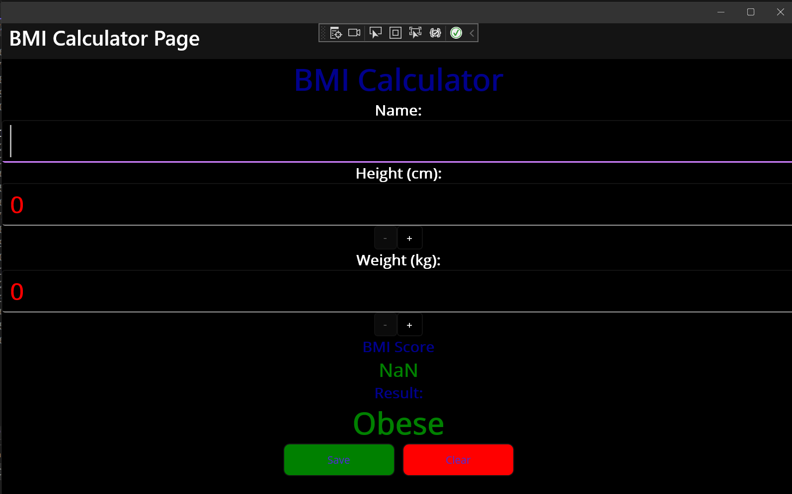
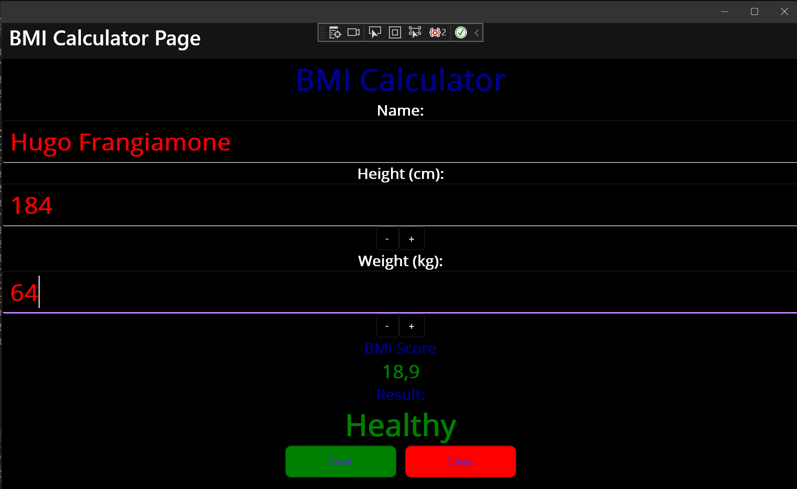
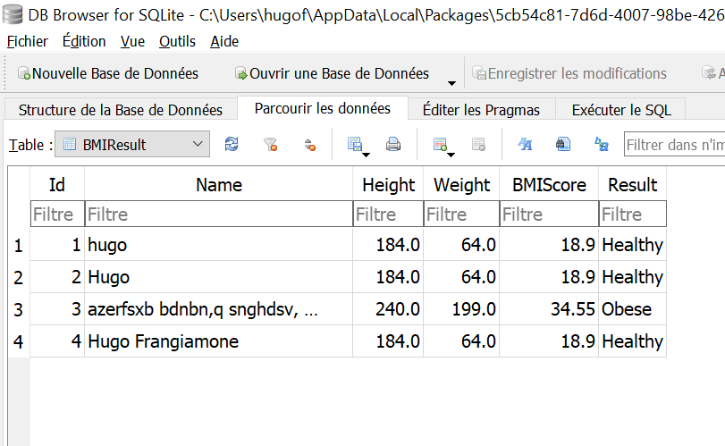

Hugo FRANGIAMONE (5999222007) - 06/04/2023
# MidTerm Project - Frameworks-based Programming

## Description
Our app is a BMI calculator. It allows you to calculate your BMI and to know if you are underweight, normal, overweight or obese. It also allows you to save your BMI into a SQLite database.

## Usage
Once the solution is launched, yuo should see the following screen:



You enter your name, your weight and your height and you should see your BMI and your BMI category displayed on the screen:



You can also save your BMI into the database by clicking on the "Save" button. Here is the saved data after clicking on the "Save" button:



Finally, you can click the "Clear" button to clear the screen and start again.

## Implementation
The app is based on the MVVM pattern.
We use the following Model class:
```csharp
[Table("BMIResult")]
    public class BMIResult
    {
        [PrimaryKey, AutoIncrement]
        public int Id { get; set; }

        [NotNull]
        public string Name { get; set; }

        public double Height { get; set; }

        public double Weight { get; set; }

        public double BMIScore { get; set; }

        public string Result { get; set; }
    }
```

Our ViewModel class `BMICalculatorViewModel` has the following parameters:
```csharp
[ObservableProperty]
        public String name;

        [ObservableProperty]
        [NotifyPropertyChangedFor(nameof(BMIScore))]
        [NotifyPropertyChangedFor(nameof(BMIResult))]
        public double height;

        [ObservableProperty]
        [NotifyPropertyChangedFor(nameof(BMIScore))]
        [NotifyPropertyChangedFor(nameof(BMIResult))]
        public double weight;

        public double BMIScore
            => Math.Round(Weight / Math.Pow(Height / 100, 2), 2);

        public String BMIResult
        {
            get
            {
                if (BMIScore < 18.5)
                    return "Underweight";
                else if (BMIScore < 25)
                    return "Healthy";
                else if (BMIScore < 30)
                    return "Overweight";
                else
                    return "Obese";
            }
        }
```	

And finally, we are able to save the data into the database by using the following code:
```csharp
public void AddNewBMIResult(string name, double height, double weight, double BMIScore, string BMIResult)
        {
            Init();
            var bmiResult = new BMIResult()
            {
                Name = name,
                Height = height,
                Weight = weight,
                BMIScore = BMIScore,
                Result = BMIResult
            };
            conn.Insert(bmiResult);
        }
```

## Conclusion
We have learned how to use the MVVM pattern and how to use the SQLite database with the MAUI framework.